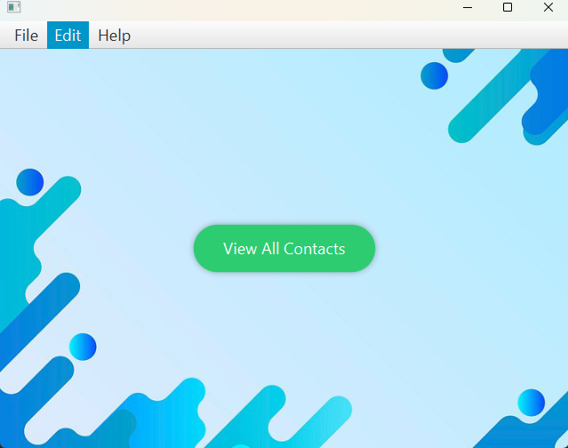
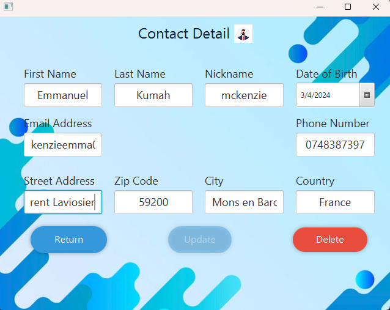
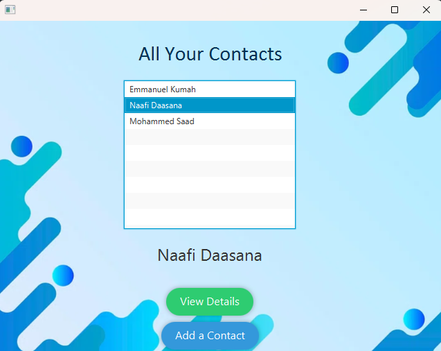
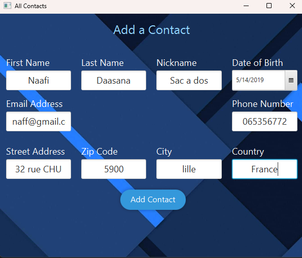
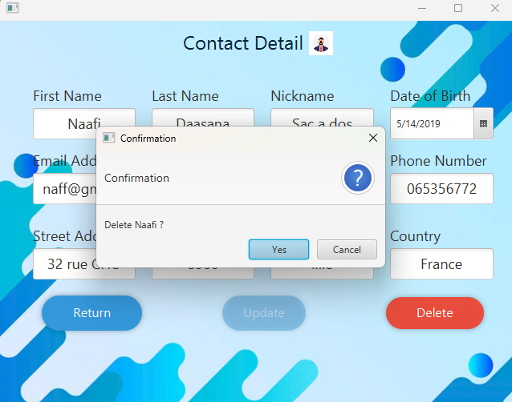

## JavaFX Contact Application

> Introduction
The JavaFX Contact Management Application is a desktop application designed to help users manage their contacts efficiently. It provides a user-friendly interface for adding, viewing, and editing contact information. The application is built using JavaFX, a modern GUI toolkit for Java applications.

> ### Viewing Contact Details:
 Users can click on a contact from the list to view detailed information about that contact, including their full name, phone number, email address, and address.

> ### Contact Listing: 
 The application allows users to view a list of their contacts. Each contact is displayed with their first name, last name, and other relevant information.

> ### Adding New Contacts: 
Users can easily add new contacts to their list by entering their details such as first name, last name, phone number, email address, and address.

> ### Deleting Contacts: 
Users can delete unwanted contacts from their list with a simple deletion feature. This allows for easy management of contacts.

