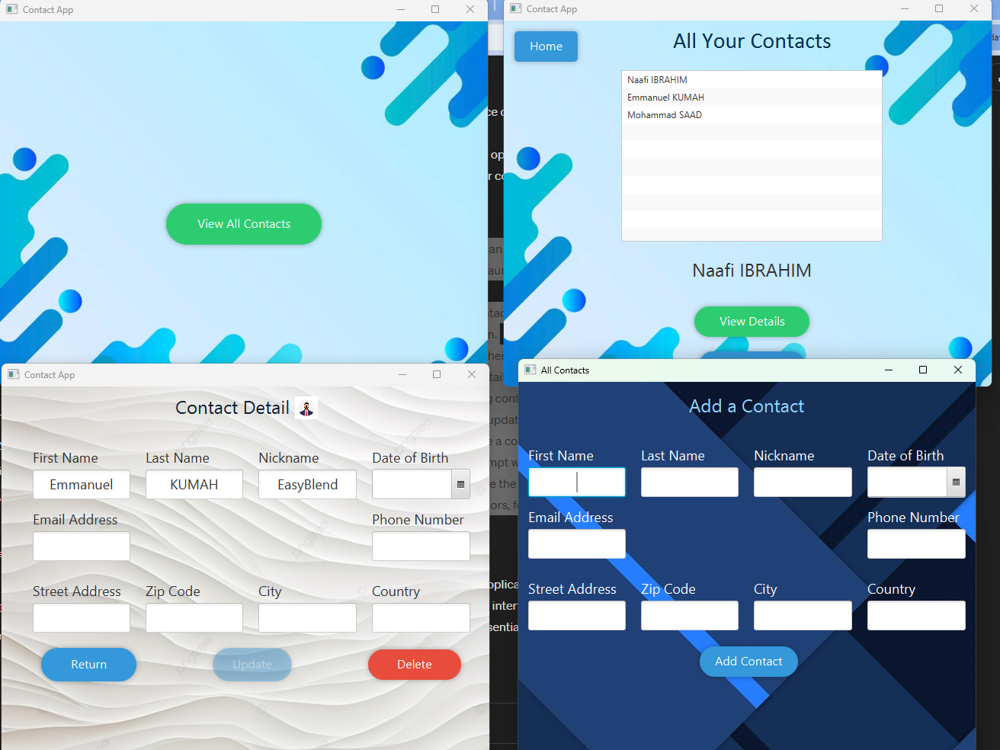
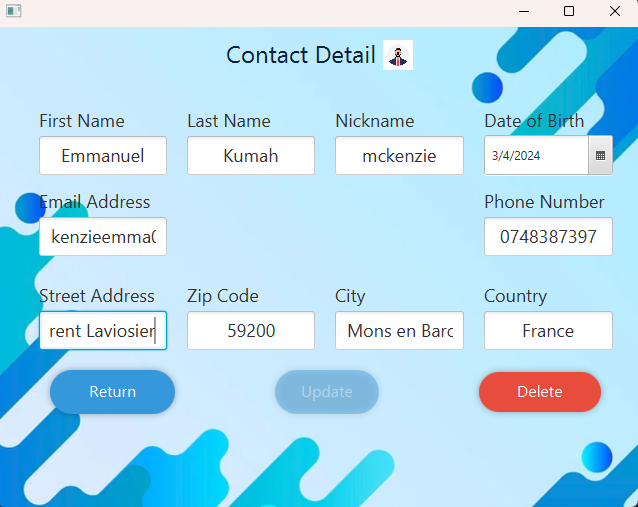
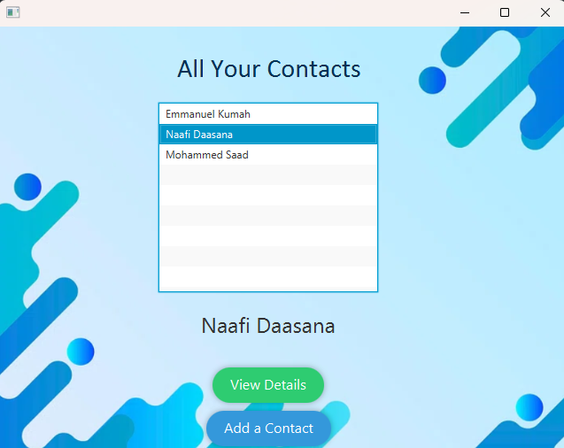
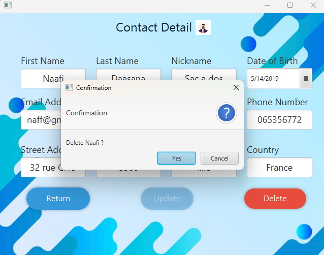
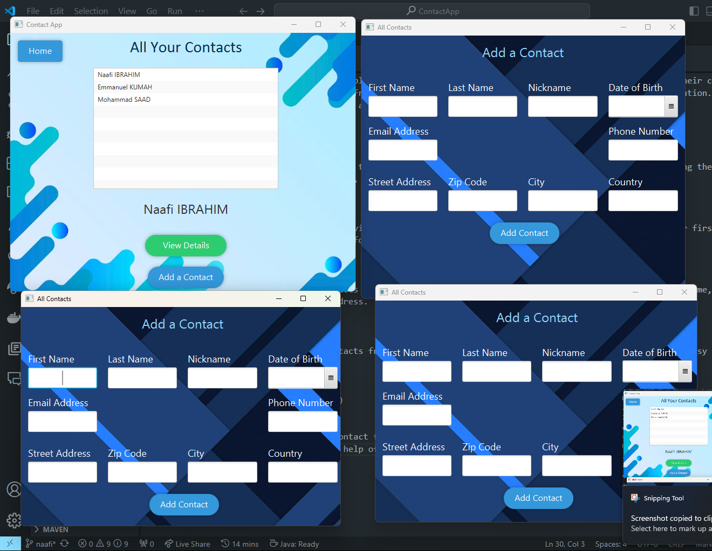

## JavaFX Contact Application

> Introduction
> The JavaFX Contact Management Application is a desktop application designed to help users manage their contacts > efficiently. It provides a user-friendly interface for adding, viewing, and editing contact information. The > application is built using JavaFX, a modern GUI toolkit for Java applications.

> ### Viewing Contact Details:
 Users can click on a contact from the list to view detailed information about that contact, including their full name, phone number, email address, and address.

> ### Contact Listing: 
> The application allows users to view a list of their contacts. Each contact is displayed with their first name, > last name, and other relevant information.

> ### Adding New Contacts: 
> Users can easily add new contacts to their list by entering their details such as first name, last name, phone > number, email address, and address.

> ### Deleting Contacts: 
> Users can delete unwanted contacts from their list with a simple deletion feature. This allows for easy management of contacts.

## Extra Feature Introduced

> Users can Open multiple add contact forms and Add multiple contacts simultaneously.
> This Feature is down with the help of a new pop up window

## Usage:

>Launching the Application: Users can launch the application by running the executable file or executing the Java > program. Upon launch, they will be greeted with the main interface displaying their contact list.

> Adding Contacts: To add a new contact, users can click on the "Add Contact" button and fill in the required details in the provided form.

> Viewing Contacts: Users can view their existing contacts by scrolling through the contact list. Clicking on a contact will display detailed information about that contact.

> Editing Contacts: To edit an existing contact, users can select the contact from the list and click on the  "Edit" button. They can then update the contact's information as needed.

> Deleting Contacts: Users can delete a contact by selecting it from the list and clicking on the "Delete" ? button. A confirmation prompt will ensure that the deletion is intentional.

> Customization: Users can customize the appearance of the application by modifying the CSS stylesheet. They can > change the colors, fonts, and other visual elements to create a personalized look.